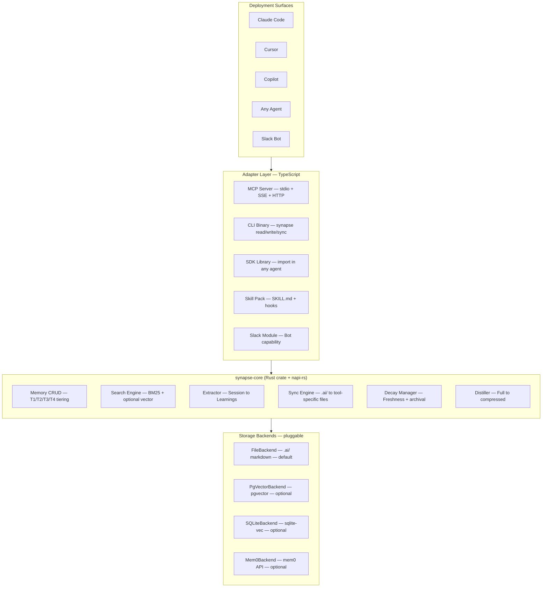
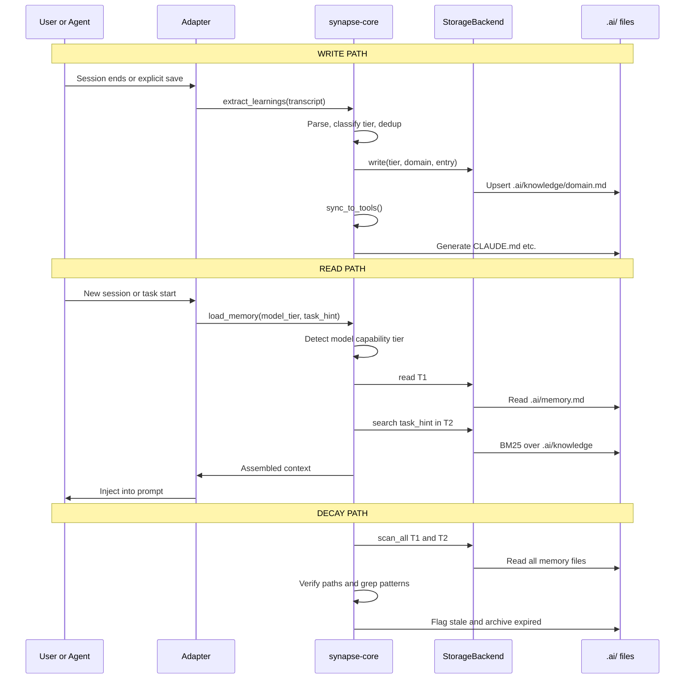

# ADR-001: SynapseVault — Modular Memory Architecture for AI Coding Agents

**Status:** Proposed  
**Date:** 2026-04-13  
**Deciders:** Sudhar  
**Builds on:** `model-agnostic-memory-architecture.md` (§1–10), `llm-instruction-engineering.md` (§1–13)

---

## Context

We have a well-defined model-agnostic memory architecture (four tiers, markdown-native, provider-agnostic sync) and a comprehensive instruction engineering reference. What we lack is a **software architecture** — the actual code structure that turns these ideas into a reusable system deployable across five surfaces:

| Surface | Protocol | How Memory Integrates |
|---------|----------|-----------------------|
| **MCP Server** | stdio / SSE / Streamable HTTP | Any MCP-capable tool calls `memory.read`, `memory.write`, `memory.search` |
| **Agent** | Claude SDK / Agent SDK / LangGraph | Self-contained agent that manages memory lifecycle autonomously |
| **Skill** | SKILL.md + file reads | Supplements an existing agent with memory-aware instructions |
| **CLI Command** | Binary / npx | `synapse read`, `synapse write`, `synapse sync`, `synapse decay` |
| **Slack Bot Capability** | Module import into existing bot | Bot gains memory between sessions via SDK calls |

**Constraints:**
- Must work with Claude, GPT, open-source models (the whole point of model-agnostic)
- Must start zero-infra (files only) but scale to team use (shared backend)
- Must be open-source, no vendor lock-in
- Your stack: TypeScript, Haskell, Rust, Svelte — core should play to strengths
- The Slack coding bot already uses Claude CLI / Claude SDK

---

## Decision

**Build a three-layer architecture: Rust core engine → TypeScript adapter layer → deployment-specific thin shells.**

The core is a Rust crate (compiled to native binary AND Node.js via `napi-rs`) that implements all memory operations. TypeScript adapters expose the core through MCP, CLI, SDK, Skill, and Slack interfaces. Each adapter is ≤200 lines of glue code.

```
┌──────────────────────────────────────────────────────┐
│                  Deployment Surfaces                  │
│  Claude Code │ Cursor │ Copilot │ Any Agent │ Slack  │
└──────┬───────┴───┬────┴────┬────┴─────┬─────┴───┬────┘
       │           │         │          │          │
┌──────┴───────────┴─────────┴──────────┴──────────┴───┐
│              Adapter Layer (TypeScript)                │
│  MCP Server │ CLI Binary │ SDK Lib │ Skill │ Slack    │
└──────────────────────┬───────────────────────────────┘
                       │
┌──────────────────────┴───────────────────────────────┐
│              synapse-core (Rust → napi-rs)            │
│                                                       │
│  ┌─────────┐ ┌──────────┐ ┌───────────┐ ┌─────────┐ │
│  │ Memory  │ │ Search   │ │ Extractor │ │  Sync   │ │
│  │  CRUD   │ │  Engine  │ │ (session  │ │ Engine  │ │
│  │ (tiers) │ │(BM25+vec)│ │→learnings)│ │(.ai/→*) │ │
│  └─────────┘ └──────────┘ └───────────┘ └─────────┘ │
│  ┌─────────┐ ┌──────────┐                            │
│  │  Decay  │ │ Distill  │                            │
│  │ Manager │ │  Engine  │                            │
│  └─────────┘ └──────────┘                            │
│                                                       │
│  ┌─────────────────────────────────────────────────┐ │
│  │        StorageBackend trait (pluggable)          │ │
│  │  FileBackend │ SQLiteVec │ PgVector │ Mem0API   │ │
│  └─────────────────────────────────────────────────┘ │
└──────────────────────────────────────────────────────┘
```

---

## Options Considered

### Option A: Pure TypeScript Monorepo

| Dimension | Assessment |
|-----------|------------|
| Complexity | Low |
| Performance | Medium — Node.js file I/O and BM25 are adequate for single-project |
| Portability | High — runs anywhere Node runs |
| Team familiarity | High — your TS is strong |
| WASM target | Possible but non-trivial (esbuild + wasm-pack alternative) |

**Pros:** Fastest to v1. MCP SDK, Claude SDK, Slack bolt are all TS. Single language. pnpm workspaces handle monorepo well.  
**Cons:** BM25/vector search in JS is 10-50× slower than Rust equivalents. No native binary for CLI distribution. Can't embed in Haskell/Rust agents without FFI.

### Option B: Rust Core + TypeScript Adapters (Recommended)

| Dimension | Assessment |
|-----------|------------|
| Complexity | Medium — napi-rs bridge adds build step |
| Performance | High — tantivy for BM25, tree-sitter for AST, native file I/O |
| Portability | Highest — native binary + WASM + Node.js via napi-rs |
| Team familiarity | High — you write Rust in production |
| WASM target | Natural — `wasm-pack` for browser/edge, `napi-rs` for Node |

**Pros:** Core logic is fast, portable, testable in isolation. `napi-rs` gives zero-cost Node.js bindings. CLI ships as single binary (no Node runtime). WASM target enables browser-based memory viewer in Svelte. Haskell agents call via FFI or CLI subprocess. The adapters stay in TypeScript where the ecosystem is.  
**Cons:** Build pipeline is more complex (cargo + napi-rs + tsc). Two-language PRs. CI needs both toolchains.

### Option C: Haskell Core + TypeScript Adapters

| Dimension | Assessment |
|-----------|------------|
| Complexity | High — GHC FFI to Node.js is painful |
| Performance | High for parsing/logic, but GHC runtime overhead for small CLI |
| Portability | Low — GHC binaries are large, no WASM story yet |
| Team familiarity | High — you write Haskell in production |

**Pros:** Type system catches more memory model invariants at compile time. Algebraic data types model tiers/backends elegantly.  
**Cons:** FFI to Node.js is the weakest path in the Haskell ecosystem. No clean `napi-rs` equivalent. Binary distribution is hard. Would isolate the project from the broader MCP ecosystem.

### Option D: Pure MCP Server (No Core Library)

| Dimension | Assessment |
|-----------|------------|
| Complexity | Low |
| Portability | Medium — only MCP clients can use it |
| Extensibility | Low — everything is an MCP tool, no programmatic API |

**Pros:** Ship fast. Any MCP client gets memory. Zero SDK design needed.  
**Cons:** Can't use as library in agents. Can't use as CLI without wrapping MCP calls. Slack bot would need MCP client SDK (overkill). Locks you into MCP as the only interface.

---

## Trade-off Analysis

The core tension is **time-to-v1** vs **long-term modularity**.

Option A (pure TS) ships in ~2 weeks but hits performance walls at T3/T4 scale and can't distribute as a standalone binary. Option B (Rust + TS) ships in ~3-4 weeks but gives you every deployment target, maximum performance, and the WASM story for a Svelte-based memory browser later.

Option D (pure MCP) is tempting but violates the "it will just be code" principle — it locks you into one protocol.

**The critical insight:** the memory system's value compounds over time. A slightly slower start with the right architecture pays back exponentially as the memory grows and you deploy across more surfaces.

**Recommendation: Option B** — Rust core with TypeScript adapters.

If you want v1 in days not weeks: start with **Option A** (pure TS), but structure it so the core is a standalone package with the same interface. Then swap the internals to Rust later (the adapters don't change).

---

## Detailed Architecture

### 1. Repository Structure

```
synapse/
├── Cargo.toml                    # Workspace: core + napi binding
├── package.json                  # pnpm workspace root
├── crates/
│   ├── synapse-core/             # Pure Rust, no Node deps
│   │   ├── src/
│   │   │   ├── lib.rs
│   │   │   ├── memory.rs         # T1/T2/T3/T4 CRUD
│   │   │   ├── search.rs         # BM25 (tantivy) + vector trait
│   │   │   ├── extractor.rs      # Transcript → learnings
│   │   │   ├── sync.rs           # .ai/ → tool-specific files
│   │   │   ├── decay.rs          # Freshness verification
│   │   │   ├── distill.rs        # Full → compressed for small models
│   │   │   ├── tier.rs           # Model capability detection
│   │   │   └── backend/
│   │   │       ├── mod.rs        # StorageBackend trait
│   │   │       ├── file.rs       # Default: .ai/ markdown files
│   │   │       ├── sqlite_vec.rs # Optional: sqlite-vec embeddings
│   │   │       └── pgvector.rs   # Optional: PostgreSQL + pgvector
│   │   └── Cargo.toml
│   └── synapse-napi/             # napi-rs bindings → npm package
│       ├── src/lib.rs
│       └── Cargo.toml
├── packages/
│   ├── mcp-server/               # MCP server adapter
│   │   ├── src/index.ts          # stdio + SSE + HTTP transport
│   │   ├── src/tools.ts          # MCP tool definitions
│   │   └── package.json
│   ├── cli/                      # CLI binary (wraps core)
│   │   ├── src/index.ts
│   │   └── package.json
│   ├── sdk/                      # Embeddable library for agents
│   │   ├── src/index.ts          # SynapseMemory class
│   │   ├── src/agent.ts          # Autonomous memory agent
│   │   └── package.json
│   ├── skill/                    # Claude Code skill pack
│   │   ├── SKILL.md              # Instructions for memory-aware coding
│   │   ├── hooks/                # PostToolUse / Stop hooks
│   │   └── references/
│   └── slack/                    # Slack bot module
│       ├── src/index.ts          # Memory capability for bolt.js
│       └── package.json
├── .ai/                          # The memory itself (dogfooding)
│   ├── memory.md
│   ├── knowledge/
│   ├── archive/
│   ├── graph/
│   └── sync/
└── tests/
    ├── core/                     # Rust unit + integration tests
    └── adapters/                 # TS adapter tests
```

### 2. The Core: `synapse-core` (Rust)

#### 2.1 StorageBackend Trait

This is the central abstraction. Everything goes through it.

```rust
/// The pluggable storage interface.
/// Default impl: FileBackend (markdown files in .ai/).
/// Optional: SQLiteVecBackend, PgVectorBackend, Mem0Backend.
pub trait StorageBackend: Send + Sync {
    /// Read memory entries from a specific tier.
    fn read(&self, tier: Tier, domain: Option<&str>) -> Result<Vec<MemoryFile>>;
    
    /// Write or update a memory entry.
    fn write(&self, entry: &MemoryEntry) -> Result<()>;
    
    /// Search across tiers. BM25 by default, vector if backend supports it.
    fn search(&self, query: &str, opts: &SearchOpts) -> Result<Vec<SearchHit>>;
    
    /// Scan for stale entries (paths changed, code drifted).
    fn scan_staleness(&self, project_root: &Path) -> Result<Vec<StaleEntry>>;
    
    /// Archive an entry from T1/T2 to T3.
    fn archive(&self, entry_id: &str, reason: &str) -> Result<()>;
}

#[derive(Debug, Clone, Copy)]
pub enum Tier { T1Hot, T2Warm, T3Cold, T4Graph }

#[derive(Debug, Clone, Copy)]
pub enum ModelTier { Execution, Balanced, Reasoning }

pub struct MemoryEntry {
    pub tier: Tier,
    pub domain: String,           // "rust-testing", "api-conventions", etc.
    pub title: String,
    pub patterns: Vec<Pattern>,   // ✓ correct patterns
    pub anti_patterns: Vec<AntiPattern>, // ✗ what fails
    pub dependencies: Vec<String>,
    pub confidence: Confidence,
    pub source: Source,
    pub updated_at: DateTime<Utc>,
}

pub struct SearchOpts {
    pub tiers: Vec<Tier>,         // Which tiers to search
    pub model_tier: ModelTier,    // Affects result depth
    pub max_results: usize,
    pub max_tokens: usize,        // Budget for assembled context
}
```

#### 2.2 Core Engine API

```rust
pub struct SynapseEngine {
    backend: Box<dyn StorageBackend>,
    config: SynapseConfig,
}

impl SynapseEngine {
    /// Assemble memory for a session, respecting model tier and token budget.
    pub fn load_memory(
        &self,
        model_tier: ModelTier,
        task_hint: Option<&str>,
    ) -> Result<AssembledMemory>;

    /// Extract learnings from a session transcript.
    pub fn extract_learnings(
        &self,
        transcript: &str,
        llm: &dyn LlmClient, // Haiku-tier for extraction
    ) -> Result<Vec<MemoryEntry>>;

    /// Merge extracted learnings into storage (dedup + classify).
    pub fn merge_learnings(
        &self,
        learnings: Vec<MemoryEntry>,
    ) -> Result<MergeReport>;

    /// Generate tool-specific files from .ai/ source.
    pub fn sync_to_tools(&self, targets: &[SyncTarget]) -> Result<()>;

    /// Run freshness check against live codebase.
    pub fn run_decay_check(&self, project_root: &Path) -> Result<DecayReport>;

    /// Distill full memory files into execution-tier summaries.
    pub fn distill(&self, tier: Tier, domain: &str) -> Result<String>;
}

pub enum SyncTarget {
    ClaudeCode,  // → CLAUDE.md
    Cursor,      // → .cursorrules
    Copilot,     // → .github/copilot-instructions.md
    Codex,       // → AGENTS.md
    Custom(PathBuf, String), // → custom path + template
}
```

#### 2.3 Why Rust for the Core

| Concern | Rust Advantage |
|---------|---------------|
| BM25 search | `tantivy` is ~50× faster than JS alternatives for indexing |
| File I/O at scale | Zero-copy reads, memory-mapped files for T3 archives |
| Binary distribution | Single static binary for CLI, no runtime deps |
| WASM | `wasm-pack` → Svelte memory browser component |
| Node.js integration | `napi-rs` gives zero-overhead JS bindings |
| Haskell interop | FFI via C ABI or subprocess (your backend agents) |
| Correctness | `StorageBackend` trait + ownership model prevents data races |

### 3. Adapter Layer (TypeScript)

#### 3.1 MCP Server (`packages/mcp-server/`)

```typescript
import { Server } from "@modelcontextprotocol/sdk/server";
import { createEngine } from "@synapse/core"; // napi-rs binding

const engine = createEngine({ backend: "file", root: ".ai/" });

// Tool: memory_read — Load assembled memory for current session
server.tool("memory_read", {
  model_tier: z.enum(["execution", "balanced", "reasoning"]),
  task_hint: z.string().optional(),
}, async ({ model_tier, task_hint }) => {
  return engine.loadMemory(model_tier, task_hint);
});

// Tool: memory_write — Store a learning from current session
server.tool("memory_write", {
  domain: z.string(),
  title: z.string(),
  pattern: z.string(),
  anti_pattern: z.string().optional(),
  confidence: z.enum(["high", "medium", "low"]),
}, async (entry) => {
  return engine.mergeLearnings([entry]);
});

// Tool: memory_search — Semantic search across all tiers
server.tool("memory_search", {
  query: z.string(),
  tiers: z.array(z.enum(["T1", "T2", "T3", "T4"])).optional(),
}, async ({ query, tiers }) => {
  return engine.search(query, { tiers });
});

// Tool: memory_sync — Regenerate tool-specific files
server.tool("memory_sync", {
  targets: z.array(z.enum(["claude", "cursor", "copilot", "codex"])),
}, async ({ targets }) => {
  return engine.syncToTools(targets);
});

// Tool: memory_decay — Run freshness check
server.tool("memory_decay", {}, async () => {
  return engine.runDecayCheck(process.cwd());
});

// Transport: stdio (local) or SSE/HTTP (remote/team)
server.listen(transport);
```

**Deployment modes:**

| Mode | Transport | Use Case |
|------|-----------|----------|
| Local | stdio | Single dev, Claude Code / Cursor MCP config |
| Remote | SSE over HTTP | Team sharing, Slack bot, multi-machine |
| Serverless | HTTP (stateless) | NOT recommended — cold starts + state management overhead |

#### 3.2 CLI (`packages/cli/`)

```
synapse read [--tier T1|T2|T3|T4] [--domain rust-testing] [--model-tier balanced]
synapse write --domain api-conventions --title "Auth header pattern" --pattern "..."
synapse search "error handling axum" [--tiers T1,T2]
synapse sync [--target claude,cursor,copilot]
synapse decay [--fix]            # Run freshness check, optionally auto-archive
synapse distill [--domain ...]   # Generate execution-tier summaries
synapse init                     # Bootstrap .ai/ directory from existing rules files
synapse extract <transcript>     # Extract learnings from a session log
```

Ships as a native binary (Rust CLI) or as `npx @synapse/cli` (Node.js wrapper over napi-rs).

#### 3.3 SDK (`packages/sdk/`)

```typescript
import { SynapseMemory } from "@synapse/sdk";

// Use programmatically in any agent framework
const memory = new SynapseMemory({
  root: ".ai/",
  backend: "file", // or "sqlite-vec", "pgvector"
});

// In your agent's system prompt assembly:
const context = await memory.load({
  modelTier: "balanced",
  taskHint: "fix authentication bug",
});
systemPrompt += context.assembled; // Tiered memory injected

// After agent completes:
await memory.extractAndMerge(sessionTranscript, {
  llm: haikuClient, // Cheap model for extraction
});
```

**Agent mode** — the SDK also exports a self-contained agent:

```typescript
import { SynapseAgent } from "@synapse/sdk/agent";

// Autonomous memory management agent (subagent in your system)
const memoryAgent = new SynapseAgent({
  memory: new SynapseMemory({ root: ".ai/" }),
  role: "memory-curator",
  // Runs extraction, dedup, decay, promotion automatically
});

// Spawn as subagent in Claude SDK / Agent SDK / Skulls
orchestrator.delegate(memoryAgent, { transcript, learnings });
```

#### 3.4 Skill Pack (`packages/skill/`)

A Claude Code skill that teaches any agent to use the memory system:

```
packages/skill/
├── SKILL.md                     # Instructions: how to read/write memory
├── hooks/
│   ├── post-session.sh          # Fires on Stop → calls `synapse extract`
│   └── pre-session.sh           # Fires on Start → calls `synapse read`
└── references/
    ├── memory-format.md         # Canonical file format (§3.2 from your doc)
    └── tier-guide.md            # What goes in T1 vs T2 vs T3 vs T4
```

The skill supplements any agent. It doesn't replace the MCP or SDK — it provides the **instructions** that tell the agent how to think about memory, while the MCP/SDK provides the **tools**.

#### 3.5 Slack Module (`packages/slack/`)

```typescript
import { SynapseMemory } from "@synapse/sdk";
import { App } from "@slack/bolt";

export function addMemoryCapability(app: App, memory: SynapseMemory) {
  // Before the bot processes a coding request, load relevant memory
  app.use(async ({ context, next }) => {
    context.memory = await memory.load({
      modelTier: "balanced",
      taskHint: context.message?.text,
    });
    await next();
  });

  // After the bot completes a task, extract learnings
  app.message(/done|complete|finished/i, async ({ context }) => {
    await memory.extractAndMerge(context.sessionLog, {
      llm: context.haikuClient,
    });
  });
}
```

Your existing Slack bot (which uses Claude CLI/SDK) imports this module and gains persistent memory between sessions.

### 4. Storage Backend Decision Matrix

| Backend | Infra | Search Type | Best For | When to Adopt |
|---------|-------|-------------|----------|---------------|
| **FileBackend** (default) | Zero — just `.ai/` directory | BM25 via tantivy | Solo dev, small-medium projects, v1 | Day 1 |
| **SQLiteVecBackend** | Single `.db` file | BM25 + vector (sqlite-vec) | Semantic search on T3 archives, still local | When T3 grows >50 files |
| **PgVectorBackend** | PostgreSQL instance | BM25 + vector (pgvector) | Team sharing, remote MCP, Slack bot | When team >1 or remote needed |
| **Mem0Backend** | Mem0 cloud API | Mem0's built-in | Quick experiment, managed memory | Only for prototyping — vendor lock-in |

**The architecture does NOT prescribe a backend.** You configure it at init:

```toml
# .ai/synapse.toml
[core]
backend = "file"           # "file" | "sqlite-vec" | "pgvector" | "mem0"
root = ".ai/"

[backends.file]
# No config needed — uses .ai/ directory

[backends.sqlite-vec]
path = ".ai/synapse.db"
embedding_model = "all-MiniLM-L6-v2"  # Local ONNX model

[backends.pgvector]
connection = "postgresql://..."
embedding_model = "text-embedding-3-small"

[backends.mem0]
api_key = "${MEM0_API_KEY}"
```

### 5. Why NOT Serverless

| Concern | Serverless Reality | Recommendation |
|---------|--------------------|----------------|
| Cold starts | Memory retrieval needs <100ms. Lambda cold starts are 500ms-2s | Use always-on for remote |
| State | Memory is stateful (file system). Serverless is stateless | Need external DB anyway → defeats simplicity |
| Cost | Low-traffic = cheap. But you're paying for DB + function + storage | Single VPS with SQLite is simpler and cheaper |
| Complexity | Need: function + DB + object storage + CDN | Single binary on a $5 VPS does it all |

**Verdict:** For remote/team mode, run the MCP server as a lightweight always-on process (Docker container, fly.io, or a VPS). Not serverless.

### 6. Why NOT Remote-First

The memory system should be **local-first, remote-optional**:

- `.ai/` directory lives in the git repo → every clone has the memory
- FileBackend works offline, zero network dependencies
- `synapse sync` generates tool-specific files locally
- Only when you need team sharing or Slack bot access do you add a remote backend
- Remote is an overlay (PgVector syncs FROM the file layer), not a replacement

This mirrors your doc's principle: "memory must be the format, not the model." The format is files. The backend is optional infrastructure on top.

---

## Consequences

**What becomes easier:**
- Every AI coding tool gains cumulative memory from the same source
- Switching between Claude Code, Cursor, Copilot preserves all knowledge
- Slack bot remembers what it learned across sessions
- New team members get all accumulated patterns via `git pull`
- Small models get compressed cheat sheets, large models get full context

**What becomes harder:**
- Two-language build (Rust + TypeScript) adds CI complexity
- napi-rs bridge needs prebuilt binaries per platform (Linux, macOS, Windows)
- StorageBackend trait must be stable — changing it ripples through all backends
- Memory format changes require migration tooling

**What we'll need to revisit:**
- Whether Haskell backend agents should call core via FFI or subprocess
- Whether T4 graph needs a real graph DB (Neo4j/Graphiti) or stays markdown
- Authentication/authorization model for remote MCP (team sharing)
- Whether extraction should happen in-process (Haiku via API) or delegated to an external agent

---

## Action Items

### Phase 0: Bootstrap (3 days)

1. [ ] Init repo: `cargo init --lib crates/synapse-core` + pnpm workspace
2. [ ] Define `StorageBackend` trait + `FileBackend` impl (Rust)
3. [ ] Implement T1/T2 read/write against `.ai/` directory
4. [ ] Wire `napi-rs` bindings for `loadMemory` + `mergeLearnings`
5. [ ] Spike: MCP server with 2 tools (`memory_read`, `memory_write`)

### Phase 1: Core Engine (Week 1-2)

6. [ ] BM25 search via tantivy over `.ai/knowledge/*.md`
7. [ ] Sync engine: `.ai/` → CLAUDE.md, .cursorrules, copilot-instructions
8. [ ] CLI: `synapse read`, `synapse write`, `synapse sync`, `synapse init`
9. [ ] Decay manager: path verification + code grep + staleness flags
10. [ ] Distillation: full T2 → compressed execution-tier tables

### Phase 2: Adapters (Week 3-4)

11. [ ] Full MCP server: all 5 tools + stdio + SSE transport
12. [ ] SDK library: `SynapseMemory` class with agent-embeddable API
13. [ ] Skill pack: SKILL.md + hooks for Claude Code
14. [ ] Slack module: bolt.js middleware for memory-aware bot
15. [ ] `SynapseAgent`: autonomous memory curator subagent

### Phase 3: Advanced Backends (Week 5-6)

16. [ ] SQLiteVecBackend: sqlite-vec + local ONNX embeddings
17. [ ] PgVectorBackend: remote team sharing
18. [ ] Extractor agent: Haiku-tier transcript → learnings pipeline
19. [ ] Critic agent: Sonnet-tier quality gate (optional pass)
20. [ ] WASM build for Svelte memory browser component

### Phase 4: Graph + Polish (Week 7-8)

21. [ ] T4 graph memory from codebase analysis (tree-sitter AST)
22. [ ] Cross-reference T2 entries with T4 graph nodes
23. [ ] Auth model for remote MCP (API keys / team tokens)
24. [ ] Metrics: token savings, pattern hit rate, stale incidents
25. [ ] Documentation + open-source release

---

## Appendix A: How Each Surface Consumes the Core

```
┌──────────────────┬──────────────────┬─────────────────────────────────────┐
│ Surface          │ Adapter          │ How It Works                        │
├──────────────────┼──────────────────┼─────────────────────────────────────┤
│ Claude Code MCP  │ mcp-server       │ Add to .claude.json mcpServers.     │
│                  │                  │ Claude calls memory_read/write      │
│                  │                  │ tools naturally in conversation.    │
├──────────────────┼──────────────────┼─────────────────────────────────────┤
│ Cursor / Copilot │ mcp-server       │ Same MCP server, different client.  │
│   (MCP mode)     │                  │ OR: `synapse sync` → .cursorrules   │
├──────────────────┼──────────────────┼─────────────────────────────────────┤
│ Any Agent        │ sdk              │ import { SynapseMemory } in agent   │
│ (Claude SDK,     │                  │ code. Call load() before prompt,    │
│  LangGraph, etc) │                  │ extractAndMerge() after session.    │
├──────────────────┼──────────────────┼─────────────────────────────────────┤
│ Agent (subagent) │ sdk/agent        │ SynapseAgent runs autonomously as   │
│                  │                  │ subagent in Skulls/multi-agent.     │
│                  │                  │ Handles extraction, decay, sync.    │
├──────────────────┼──────────────────┼─────────────────────────────────────┤
│ Skill            │ skill            │ SKILL.md instructs the host agent   │
│                  │                  │ on memory conventions. Hooks fire   │
│                  │                  │ CLI commands on session start/stop. │
├──────────────────┼──────────────────┼─────────────────────────────────────┤
│ CLI              │ cli              │ Direct terminal usage.              │
│                  │                  │ `synapse read --tier T2 --domain x` │
│                  │                  │ Useful in CI, git hooks, scripts.   │
├──────────────────┼──────────────────┼─────────────────────────────────────┤
│ Slack Bot        │ slack            │ Import addMemoryCapability into     │
│                  │                  │ existing bolt.js bot. Memory loads  │
│                  │                  │ before task, extracts after.        │
└──────────────────┴──────────────────┴─────────────────────────────────────┘
```

## Appendix B: Mermaid Diagrams

### B.1 High-Level Architecture



### B.2 Data Flow — Read/Write/Decay



## Appendix C: Key Haskell/Rust Integration Note

Your backend agents run in Haskell. Two integration paths:

**Path 1 — Subprocess (recommended for v1):**
Haskell agent shells out to `synapse read --tier T2 --domain rust-testing --format json` and parses the JSON response. Zero FFI. Works immediately.

**Path 2 — FFI (v2, if performance matters):**
`synapse-core` exposes a C ABI via `#[no_mangle] pub extern "C" fn`. Haskell calls via its FFI. More complex but zero serialization overhead.

**Path 3 — MCP client in Haskell:**
Your Haskell agent connects to the MCP server as a client. This gives full tool access but adds network overhead. Best for remote/team scenarios.
